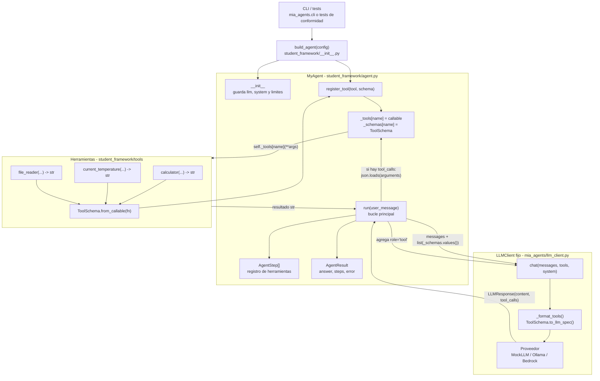
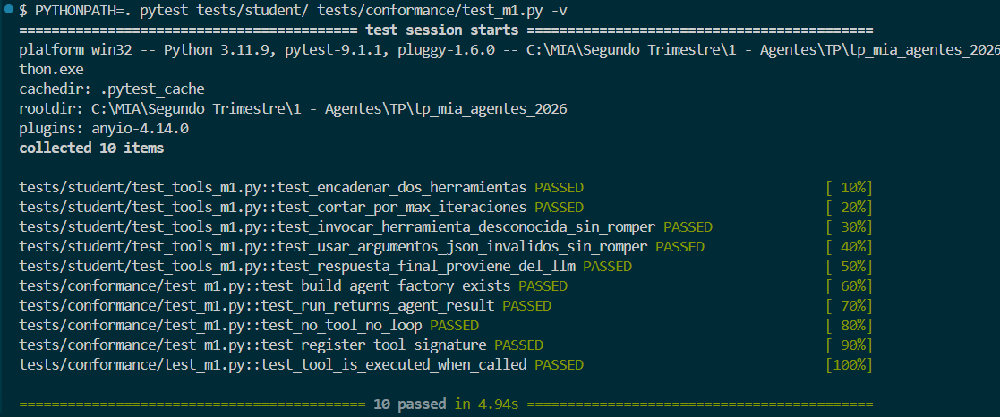

# Informe Milestone 1

## 1. Diagrama de arquitectura

El framework esta separado en cuatro piezas principales:

- `build_agent`, que construye el agente y registra herramientas.
- `MyAgent`, que contiene el bucle de conversacion y ejecucion de herramientas.
- Las herramientas Python, que son callables normales.
- `LLMClient`, que es fijo y traduce el formato interno al proveedor real o mock.



Flujo general:

1. La CLI o los tests llaman a `build_agent(config)`.
2. `build_agent` crea un `MyAgent`, usa el `llm_client` de `config` si existe, o `LLMClient.from_env()` si no existe.
3. `build_agent` importa las tres herramientas (`calculator`, `current_temperature`, `file_reader`) y registra cada una con `agent.register_tool(callable, schema)`.
4. `run(user_message)` inicia el historial con el mensaje del usuario y llama al LLM con los esquemas disponibles.
5. Si el LLM pide herramientas, el agente ejecuta los callables, agrega sus resultados al historial y vuelve a consultar al LLM.
6. Si el LLM responde sin `tool_calls`, el agente devuelve un `AgentResult` con la respuesta final.

## 2. Diseño de la interfaz de herramientas

### `ToolSchema.from_callable`

Una herramienta se define como una funcion Python comun que devuelve `str`. El esquema para el LLM se genera con:

```python
calculator_schema = ToolSchema.from_callable(calculator)
```

`ToolSchema.from_callable` esta definido en `mia_agents/types.py` y delega en `tool_schema_from_callable`, dentro de `mia_agents/tool_schema.py`.

Ese proceso deriva tres datos:

| Dato de origen | Dato generado |
| --- | --- |
| `fn.__name__` | `ToolSchema.name` |
| Docstring de la funcion | `ToolSchema.description` |
| Firma tipada de la funcion | `ToolSchema.parameters` como JSON Schema |

Ejemplo simplificado:

```python
def calculator(
    left_operand: Annotated[
        float,
        Field(description="El primer operando.")
    ],
    right_operand: Annotated[
        float,
        Field(description="El segundo operando.")
    ],
    operator: Annotated[
        str,
        Field(description="Operador: '+', '-', '*' o '%'.")
    ],
) -> str:
    """Realiza una operacion aritmetica binaria entre dos numeros."""
    ...
```

Con esa firma, el framework genera un JSON Schema con propiedades para `left_operand`, `right_operand` y `operator`.

El mismo patron se aplica a `file_reader`:

```python
def file_reader(
    path: Annotated[
        str,
        Field(description="Ruta al archivo de texto a leer.")
    ],
) -> str:
    """Lee el contenido de un archivo de texto y lo devuelve como cadena."""
    ...
```

### `Annotated` y `Field`

`Annotated` permite conservar el tipo Python y sumar metadatos. En este proyecto se usa junto con `pydantic.Field`:

```python
city: Annotated[
    str,
    Field(description="Nombre de la ciudad en cualquier idioma.")
]
```

El tipo base (`str`, `float`, etc.) se convierte en el tipo JSON correspondiente. La descripcion de `Field(...)` queda en el schema del parametro, para que el LLM sepa que argumentos debe construir.

Internamente, `tool_schema_from_callable`:

1. Lee la firma con `inspect.signature(fn)`.
2. Lee las anotaciones con `get_type_hints(fn, include_extras=True)`.
3. Crea un modelo Pydantic dinamico con `create_model(...)`.
4. Convierte ese modelo a JSON Schema con `model.model_json_schema()`.

### Que guarda `register_tool`

`register_tool` recibe dos cosas:

```python
def register_tool(self, tool: Callable[..., str], schema: ToolSchema) -> None:
    self._tools[schema.name] = tool
    self._schemas[schema.name] = schema
```

El agente guarda dos diccionarios paralelos:

- `_tools`: nombre de herramienta -> funcion Python ejecutable.
- `_schemas`: nombre de herramienta -> `ToolSchema` que se expone al LLM.

Esta separacion es importante: el LLM solo ve schemas, pero el agente necesita los callables reales para ejecutar.

### Que se pasa en `chat(tools=...)`

En cada iteracion de `run`, el agente llama:

```python
resp = self._llm.chat(
    messages=messages,
    tools=list(self._schemas.values()) if self._schemas else None,
    system=self._system,
)
```

Por lo tanto, el agente pasa una lista de objetos `ToolSchema`. No pasa las funciones Python. El LLM no puede ejecutar codigo; solo recibe la descripcion de las herramientas y decide si quiere pedir una llamada.

### Que hace el `LLMClient` fijo con cada esquema

`LLMClient` no contiene la logica del agente. Su responsabilidad es adaptar datos al proveedor.

Cuando recibe `tools`, el provider llama a `_format_tools(...)`. Ese metodo:

1. Convierte cada `ToolSchema` a dict con `to_llm_spec()`.
2. Obtiene un formato comun:

```python
{
    "name": schema.name,
    "description": schema.description,
    "parameters": schema.parameters,
}
```

3. Envuelve ese dict en el formato nativo del proveedor.

Para Ollama:

```python
{
    "type": "function",
    "function": {
        "name": spec["name"],
        "description": spec["description"],
        "parameters": spec["parameters"],
    },
}
```

Para Bedrock Converse:

```python
{
    "toolSpec": {
        "name": spec["name"],
        "description": spec["description"],
        "inputSchema": {"json": spec["parameters"]},
    },
}
```

Cuando el proveedor responde, `LLMClient` tambien normaliza la salida a un `LLMResponse` comun:

```python
LLMResponse(
    content=...,
    tool_calls=[
        ToolCall(id=..., name=..., arguments="...")
    ],
)
```

Asi, `MyAgent` siempre trabaja con el mismo contrato, sin depender de si atras hay MockLLM, Ollama o Bedrock.

## 3. Como termina el bucle y que pasa con los limites

### Terminacion normal

El bucle principal esta en `MyAgent.run`:

```python
for _ in range(self._max_iterations):
    resp = self._llm.chat(...)
```

La salida normal ocurre cuando el LLM responde sin llamadas a herramientas:

```python
if not resp.tool_calls:
    return AgentResult(
        answer=resp.content or "",
        steps=steps,
    )
```

En ese caso:

- `answer` contiene el texto final del LLM.
- `steps` contiene las herramientas ejecutadas antes de llegar a esa respuesta.
- `error` queda en `None`.

### Cuando el LLM pide herramientas

Si `resp.tool_calls` no esta vacio, el agente no termina. Primero agrega al historial el mensaje del asistente con las llamadas solicitadas:

```python
messages.append({
    "role": "assistant",
    "content": resp.content or "",
    "tool_calls": [...],
})
```

Luego, por cada `ToolCall`:

1. Busca la funcion en `self._tools` usando `tool_call.name`.
2. Decodifica argumentos con `json.loads(tool_call.arguments)`.
3. Ejecuta `self._tools[tool_call.name](**args)`.
4. Registra un `AgentStep`.
5. Agrega un mensaje `role: "tool"` con el resultado.

Ese historial aumentado se usa en la siguiente llamada a `chat(...)`, para que el LLM pueda producir la respuesta final usando los resultados.

### Herramienta desconocida o error al ejecutar

Si el LLM pide una herramienta que no esta registrada, el agente no lanza una excepcion hacia afuera. Registra un paso con error y agrega ese error al historial:

```python
try:
    args = json.loads(tool_call.arguments)
    tool = self._tools[tool_call.name]
    output = tool(**args)
    error = None
except KeyError:
    output = f"Error: herramienta desconocida '{tool_call.name}'"
    error = output
except json.JSONDecodeError:
    output = f"Error: argumentos JSON invalidos para '{tool_call.name}'"
    error = output
except Exception as e:
    output = f"Error: excepcion al ejecutar '{tool_call.name}': {e}"
    error = output

steps.append(AgentStep(
    tool_name=tool_call.name,
    tool_input=tool_call.arguments,
    tool_output=output,
    error=error,
))
```

Se manejan tres casos: herramienta no registrada (KeyError), argumentos con JSON invalido (JSONDecodeError), y cualquier otra excepcion en la ejecucion (Exception). En los tres casos, tool_output recibe el string de error (no None) y error recibe el mismo valor. El error se agrega tambien al historial como mensaje role: "tool", para que el LLM pueda corregirse en la siguiente iteracion.

### Limite de iteraciones

`max_iterations` evita bucles infinitos. Si el LLM sigue pidiendo herramientas y nunca produce una respuesta final, el `for` se agota.

En ese caso `run` devuelve:

```python
return AgentResult(
    answer="",
    steps=steps,
    error="Se alcanzo el limite de iteraciones sin respuesta final.",
)
```

Consecuencias:

- No hay respuesta final, por eso `answer` es `""`.
- No se pierden los pasos ya ejecutados: `steps` queda completo hasta el corte.
- `error` explica que el corte fue por limite de iteraciones.
- El metodo termina de forma controlada y nunca queda en un loop infinito.

### Limite de mensajes (`max_history_messages`)

El constructor acepta:

```python
max_history_messages: int = 50
```

En la implementacion actual de M1, ese valor se guarda en:

```python
self._max_history_messages = max_history_messages
```

pero todavia no se aplica para recortar el historial. Durante M1, `messages` crece dentro de una sola llamada a `run`:

- empieza con el mensaje del usuario;
- por cada iteracion con herramientas, agrega un mensaje `assistant`;
- agrega ademas un mensaje `tool` por cada herramienta ejecutada.

Por lo tanto, si se alcanza el limite de iteraciones, el corte real lo produce `max_iterations`, no `max_history_messages`.

El limite de mensajes corresponde al Milestone 2: ahi el agente debe garantizar que ninguna llamada a `self._llm.chat(...)` reciba una lista `messages` de longitud mayor a `self._max_history_messages`, incluso cuando haya historial conversacional entre varias llamadas a `run`.

## 4. Limitaciones conocidas

1. System prompt mejorable — el modelo local tiende a alucinar llamadas a herramientas; el prompt mitiga pero no elimina el problema.
2. Manejo de errores perfectible — falta distinguir tipos de error y aplicar reintentos selectivos.
3. Respuesta no siempre basada en la tool — el LLM a veces ignora el tool_output exacto y genera un resultado propio.
4. Control de comportamiento del LLM via system prompt — el agente no incluye logica condicional para decidir si reportar o modificar el resultado de una herramienta. En su lugar, el system_prompt instruye al LLM a reportar el resultado exacto que devuelve cada herramienta, sin modificarlo. Esto mantiene el bucle limpio (solo dos condiciones de parada) pero delega la responsabilidad al modelo.

## 5. Evidencia de ejecución de tests

Los 10 tests pasan: 5 propios (`tests/student/`) y 5 de conformidad (`tests/conformance/test_m1.py`).



### Tests de conformidad (`tests/conformance/test_m1.py`)

Provistos por la cátedra. Verifican el contrato público del agente de forma
automática inyectando un `MockLLMClient`, sin depender de ningún proveedor
real. No fueron modificados.

| Test | Qué verifica |
|---|---|
| `test_build_agent_factory_exists` | `build_agent` existe y devuelve un objeto `Agent` |
| `test_run_returns_agent_result` | `run()` siempre devuelve un `AgentResult` |
| `test_no_tool_no_loop` | si el LLM responde sin `tool_calls`, el agente termina en una sola llamada |
| `test_register_tool_signature` | `register_tool` acepta la firma `(callable, ToolSchema)` |
| `test_tool_is_executed_when_called` | cuando el LLM emite un `tool_call`, el callable se ejecuta y el resultado se realimenta |

### Tests propios (`tests/student/test_tools_m1.py`)

Escritos por el grupo para verificar escenarios específicos del bucle y casos límite.

| Test | Qué verifica |
|---|---|
| `test_encadenar_dos_herramientas` | el agente ejecuta dos herramientas en secuencia (`file_reader` → `calculator`) dentro de un mismo `run`, registrando un paso por cada una |
| `test_cortar_por_max_iteraciones` | si el LLM nunca deja de pedir herramientas, el agente corta exactamente al llegar a `max_iterations` (10) y devuelve un `AgentResult` válido |
| `test_invocar_herramienta_desconocida_sin_romper` | si el LLM alucina un nombre de herramienta inexistente, `run` no lanza excepción y registra el error en el `AgentStep` |
| `test_usar_argumentos_json_invalidos_sin_romper` | si el LLM genera argumentos que no son JSON válido, `run` no lanza excepción y registra el error en el `AgentStep` |
| `test_respuesta_final_proviene_del_llm` | tras ejecutar una herramienta, el agente continúa el bucle y `result.answer` es el texto que devuelve el LLM, no el output de la tool |

