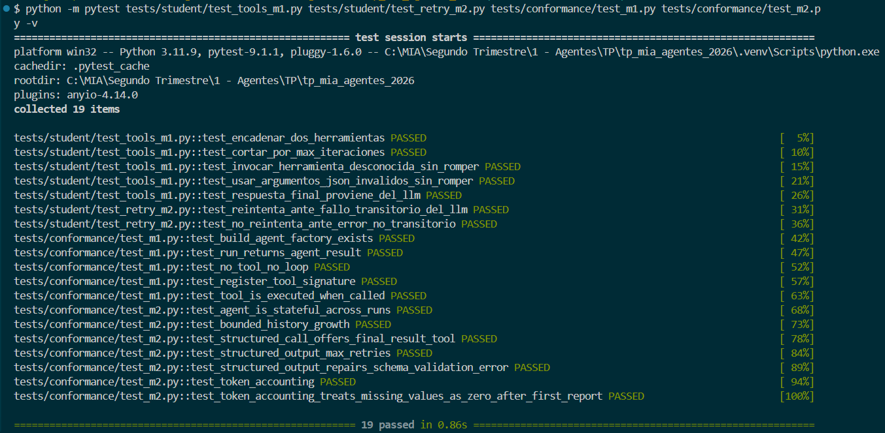

# Informe Milestone 2

## 1. Estrategia de memoria

### Statefulness entre llamadas a `run`

En M1 cada `run` era independiente. En M2 el agente guarda el historial
en el atributo de instancia `self._history` (una lista de mensajes con
formato `{"role": ..., "content": ...}`), inicializado en el
constructor. Cada `run(user_message)`:

1. Agrega el nuevo mensaje de usuario a `self._history`.
2. Registra su posición en `self._last_user_index`.
3. Dentro del bucle, agrega los mensajes `assistant` y `tool` a ese
   mismo historial.

Como `self._history` persiste entre llamadas, un segundo `run` sobre la
misma instancia "ve" todo lo anterior: el agente es conversacional.

### Estrategia elegida: sliding window

El tope `max_history_messages` (default 50) limita cuántos mensajes se
envían al LLM en **cada** llamada a `chat(...)`. No recortamos
`self._history` (mantenemos el registro completo en memoria); en su
lugar, calculamos en cada iteración una **ventana** con
`_windowed_history()`, que es lo único que viaja al LLM.

La estrategia es una *ventana deslizante* sobre la cola del historial
(los mensajes más recientes), porque en una conversación el contexto
reciente suele ser el más relevante para el próximo turno.

### Invariante de recencia

La regla que nunca se rompe: **el mensaje de usuario más reciente
siempre está en la ventana enviada al LLM**. `_windowed_history()` lo
garantiza así:

- Si `len(history) <= budget`, se manda todo (no hace falta recortar).
- Si hay que recortar y el último mensaje de usuario ya cae dentro de la
  cola de tamaño `budget`, se devuelve simplemente esa cola.
- Si el último mensaje de usuario quedaría **fuera** de la cola, se lo
  ancla explícitamente al frente de la ventana y se rellena el resto
  (`budget - 1`) con los mensajes más recientes. Así el presupuesto se
  respeta y el turno actual del usuario nunca se pierde.

```python
def _windowed_history(self) -> list[dict[str, Any]]:
    budget = self._max_history_messages
    history = self._history
    if len(history) <= budget:
        return list(history)
    window_start = len(history) - budget
    if self._last_user_index >= window_start:
        return list(history[window_start:])
    last_user_message = history[self._last_user_index]
    remaining = budget - 1
    tail = history[-remaining:] if remaining > 0 else []
    return [last_user_message, *tail]
```

### Resiliencia en conversaciones largas

Como el tope se aplica a lo enviado (no al historial guardado), el agente
sobrevive a decenas de turnos con mensajes grandes sin que la lista de
`messages` crezca sin límite. Cada `run` sigue devolviendo un
`AgentResult` con `answer` no vacío.

### Tradeoffs y modos de fallo asumidos

- **Pérdida de contexto antiguo:** al descartar mensajes viejos, el
  agente puede "olvidar" datos mencionados muchos turnos atrás. Es el
  costo esperado de una ventana deslizante; se prioriza recencia.
- **Coherencia de la ventana:** al anclar el último mensaje de usuario
  al frente cuando queda fuera de la cola, la ventana puede quedar con
  un salto (mensaje viejo + cola reciente). Se aceptó por ser la forma
  más simple de respetar a la vez el presupuesto y la invariante de
  recencia.
- No se implementó *summarization* ni *offload/retrieve*; quedaron fuera
  de alcance a favor de la estrategia obligatoria (sliding window).

## 2. Salida estructurada

`structured_call(prompt, schema, max_repair_attempts=2)` fuerza al LLM a
responder con datos válidos contra un modelo Pydantic, usando la
herramienta sintética obligatoria `final_result`.

### Cómo se ofrece `final_result` al LLM

El schema de la tool se construye con
`final_result_tool_schema(schema)` (de `mia_agents`), y se pasa en
`tools=[final_tool]` en **cada** llamada a `chat(...)` dentro del método.
El nombre de la tool es fijo (`FINAL_RESULT_TOOL_NAME`). La conversación
interna arranca con un único mensaje `user` con el `prompt`.

### Cómo se validan los argumentos

En cada respuesta se busca el `tool_call` cuyo nombre sea
`FINAL_RESULT_TOOL_NAME`. Si aparece, se decodifican sus `arguments`
(JSON) y se validan con `schema.model_validate(args)`. Si valida, se
devuelve la instancia Pydantic ya tipada y el método termina.

### Cómo se reparan los fallos

Hay dos modos de fallo, cada uno con su reparación:

1. **El modelo responde con texto libre** (no invoca la tool): se agrega
   su respuesta y un mensaje `user` de reparación que le recuerda que
   **debe** invocar `final_result` y no responder con texto libre.
2. **Los argumentos no validan** (`JSONDecodeError` o
   `ValidationError`): se agrega el `tool_call` fallido y un mensaje
   `tool` con el detalle del error de validación, pidiéndole corregir
   los argumentos y volver a invocar la tool.

En ambos casos el bucle reintenta incluyendo el fallo en el historial,
para que el modelo se autocorrija.

### Reintentos y estrategia de fallo

El bucle corre `max_repair_attempts + 1` veces (1 intento inicial + N
reparaciones). Si se agotan sin obtener una respuesta válida, se levanta
un `RuntimeError` explícito — **no** se devuelve `None` ni una instancia
parcial. Esto cumple el criterio del enunciado: o se recupera, o falla
limpiamente.

### Ejemplo concreto de reparación

Con `Answer(result: int, comment: str)`, el modelo responde primero
`final_result({"result": "cuarenta y dos", "comment": "x"})`. La
validación falla porque `result` no es un entero; se agrega un mensaje
`tool` con el error y se reintenta. En el segundo intento el modelo
responde `final_result({"result": 42, "comment": "ok"})`, que valida, y
`structured_call` devuelve la instancia `Answer` correspondiente.

## 3. Errores recuperables en herramientas

En M1 las herramientas o crasheaban o devolvían mensajes genéricos. En M2
la calculadora y el lector de archivos distinguen los **errores
recuperables** (los que el LLM puede corregir cambiando sus argumentos y
reintentando) y devuelven, en lugar de una excepción, un `str` que empieza
con `Error:`, nombra el parámetro/valor que falló e indica cómo corregirlo.

Idea de diseño transversal: la herramienta nunca lanza una excepción hacia
el bucle del agente por una entrada inválida esperable. Devuelve un mensaje
accionable que el agente vuelca al historial como `role: "tool"`, de modo
que el LLM lo lea y se corrija en la siguiente iteración.

### 3.1. Calculadora (`student_framework/tools/calculator.py`)

| Error recuperable | Información que devuelve al LLM |
| --- | --- |
| Operando no numérico | El parámetro que falló (`left_operand` / `right_operand`), el valor exacto recibido, su tipo, y un ejemplo válido (`3` o `2.5`). |
| Operador no soportado | El operador inválido y la lista completa de permitidos: `'+', '-', '*', '%'`. |
| Módulo por cero | Que `right_operand` es 0 y que hay que pasar un divisor distinto de cero (mensaje específico, no genérico). |

Detalles de implementación:

- La validación de operandos vive en el helper `_coerce_operand(name, value)`,
  que devuelve `(numero, None)` en caso de éxito o `(None, mensaje)` con el
  error accionable.
- Acepta además números pasados como texto (`"3"` → `3.0`), un caso
  frecuente cuando el LLM serializa mal los argumentos.
- Rechaza `bool` como operando (aunque `bool` sea subclase de `int`), porque
  para una calculadora no es un número válido.

**Ejemplo concreto de recuperación:**

El LLM llama `calculator(left_operand="23a", right_operand=17, operator="*")`.
La herramienta devuelve:

```
Error: el parametro 'left_operand' debe ser numerico, pero recibio el texto
'23a', que no representa un numero. Pasa un numero, por ejemplo 3 o 2.5.
```

Con ese mensaje el LLM identifica exactamente qué argumento corregir y
reintenta `calculator(23, 17, "*")`, obteniendo `391.0`.

### 3.2. Lector de archivos (`student_framework/tools/file_reader.py`)

El lector define un **sandbox** cuya raíz es el directorio del proyecto
(`cwd`). Solo se aceptan rutas relativas ancladas a esa raíz; las rutas
absolutas se rechazan explícitamente, para que el lector no pueda usarse
para acceder a archivos fuera del proyecto.


| Error recuperable | Información que devuelve al LLM |
| --- | --- |
| Ruta vacía | Que la ruta está vacía y un ejemplo de ruta válida (`'datos/notas.txt'`). |
| Ruta con `..` | Que contiene navegación a directorios superiores (no permitido) y cómo se ve una ruta válida sin `..`. |
| Ruta que escapa del sandbox (p. ej. symlink) | Que la ruta sale del directorio permitido (muestra el root) y que use una ruta relativa dentro del proyecto. |
| Archivo inexistente | Si el directorio contenedor existe, **lista los archivos disponibles** ahí para que el LLM elija la ruta correcta. |
| La ruta es un directorio | Que apunta a un directorio, no a un archivo, y **lista los archivos** dentro de ese directorio. |
| Extensión no permitida | La extensión recibida y la lista de extensiones válidas. |
| Archivo demasiado grande | Que superó el tope de tamaño (`_MAX_BYTES`). |
| Archivo no UTF-8 | Que no es texto UTF-8 válido; solo se leen archivos de texto. |
| Ruta absoluta | Que las rutas absolutas no están permitidas y debe usar una ruta relativa dentro del proyecto, por ejemplo `'datos/notas.txt'`. |


Orden de validación (de más barato/estructural a más costoso): ruta vacía →
`..` → escape del sandbox → inexistencia → directorio → extensión → lectura
(tamaño/UTF-8). Ese orden permite dar el mensaje más útil primero (por
ejemplo, listar archivos disponibles antes de quejarse de la extensión).

**Ejemplo concreto de recuperación:**

El LLM llama `file_reader(path="notas.txt")` pero el archivo real se llama
`numero.txt`. La herramienta devuelve:

```
Error: el archivo 'notas.txt' no existe. En el directorio 'C:\...\proyecto'
hay estos archivos disponibles: numero.txt, README.md, ...
```

El LLM ve el nombre correcto en la lista y reintenta
`file_reader(path="numero.txt")`, obteniendo el contenido.

## 4. Modos de fallo dentro / fuera de alcance

### Dentro de alcance

- **Memoria conversacional:** pérdida de contexto antiguo por la ventana
  deslizante (se prioriza recencia sobre completitud); el agente no se
  rompe ni pierde el turno actual del usuario, incluso en conversaciones
  de decenas de turnos con mensajes grandes.
- **Salida estructurada:** argumentos inválidos contra el schema Pydantic,
  y el caso en que el modelo responde con texto libre en vez de invocar
  `final_result` — ambos se reparan con reintentos acotados
  (`max_repair_attempts`), y si se agotan, se levanta una excepción
  explícita en lugar de devolver `None` o un resultado parcial.
- **Errores de argumentos en herramientas:** operandos no numéricos,
  operador inválido, división/módulo por cero (calculadora); rutas
  vacías, con `..`, absolutas, que escapan del sandbox, inexistentes,
  que apuntan a un directorio, con extensión no permitida, demasiado
  grandes o no UTF-8 (lector de archivos). En todos los casos la
  herramienta devuelve un mensaje accionable en vez de lanzar una
  excepción, para que el LLM pueda corregir y reintentar.
- **Fallos transitorios de infraestructura:** timeouts, errores de
  conexión y errores de red (`TimeoutError`, `ConnectionError`,
  `URLError`/`HTTPError`) tanto en las llamadas al cliente LLM (en `run`
  y en `structured_call`) como en la ejecución de herramientas con I/O
  real (`current_temperature`). Se reintentan hasta 3 veces; el resto de
  las excepciones se propaga sin reintentar.
- **Herramienta desconocida o argumentos JSON inválidos** (heredado de
  M1): el agente no se rompe, registra el fallo como `AgentStep` con
  `error` no nulo.

### Fuera de alcance (deliberadamente)

- **Backoff entre reintentos:** tanto en `_call_with_retries` como en la
  reparación de `structured_call`, los reintentos son inmediatos, sin
  espera progresiva. Se prioriza mantener los tests deterministas y
  rápidos por sobre simular un comportamiento de producción más realista.
- **Detección de rate limiting específica por proveedor:** no se
  interpretan headers como `Retry-After` ni códigos de error propios de
  Bedrock/Ollama — solo se reconocen tipos de excepción genéricos de
  Python (`TimeoutError`, `ConnectionError`, `URLError`). Un error 429 o
  5xx real de un proveedor que no se traduzca a uno de estos tipos no se
  reintentaría.
- **Estrategias de memoria alternativas a sliding window**
  (*summarization*, *offload/retrieve*): se consideraron pero no se
  implementaron; se optó por la estrategia obligatoria del enunciado por
  simplicidad y por ser suficiente para los escenarios evaluados.
- **Persistencia de `self._history` entre procesos:** la memoria vive
  solo en la instancia de `MyAgent` en memoria; se pierde si se recrea el
  agente (por ejemplo, entre invocaciones separadas de la CLI).
- **Alucinaciones del LLM no relacionadas con el formato:** por ejemplo,
  que el modelo decida no usar una herramienta disponible cuando sí
  correspondía (ya observado con la calculadora en pruebas manuales) — no
  es un fallo que el framework pueda detectar ni corregir, al ser una
  decisión del modelo y no un error de formato o de infraestructura.

## 5. Evidencia de ejecución de tests

Los 19 tests pasan: 12 de conformidad (`tests/conformance/test_m1.py` +
`test_m2.py`) y 7 propios (`tests/student/`).



### Tests de conformidad (`tests/conformance/test_m1.py` + `test_m2.py`)

Provistos por la cátedra. Verifican el contrato público del agente de forma
automática inyectando un `MockLLMClient`, sin depender de ningún proveedor
real. No fueron modificados.

| Test | Qué verifica |
|---|---|
| `test_build_agent_factory_exists` | `build_agent` existe y devuelve un objeto `Agent` |
| `test_run_returns_agent_result` | `run()` siempre devuelve un `AgentResult` |
| `test_no_tool_no_loop` | si el LLM responde sin `tool_calls`, el agente termina en una sola llamada |
| `test_register_tool_signature` | `register_tool` acepta la firma `(callable, ToolSchema)` |
| `test_tool_is_executed_when_called` | cuando el LLM emite un `tool_call`, el callable se ejecuta y el resultado se realimenta |
| `test_agent_is_stateful_across_runs` | llamadas sucesivas a `run` sobre la misma instancia continúan la misma conversación |
| `test_bounded_history_growth` | ninguna llamada a `chat(...)` supera `max_history_messages`, sin importar cuántos turnos lleve la conversación |
| `test_structured_call_offers_final_result_tool` | la primera llamada de `structured_call` ofrece la tool `final_result` |
| `test_structured_output_max_retries` | agotados los reintentos de reparación, se levanta una excepción (nunca `None` ni un valor parcial) |
| `test_structured_output_repairs_schema_validation_error` | argumentos inválidos contra el schema se reparan y `structured_call` devuelve la instancia validada |
| `test_token_accounting` | `AgentResult.input_tokens`/`output_tokens` suman lo reportado por el LLM a lo largo de `run` |
| `test_token_accounting_treats_missing_values_as_zero_after_first_report` | una vez que hay tokens reportados, las respuestas sin tokens cuentan como 0 |

### Tests propios (`tests/student/test_tools_m1.py` + `test_retry_m2.py`)

Escritos por el grupo para verificar escenarios específicos del bucle,
casos límite, y resiliencia ante fallos transitorios (sin test de
conformidad provisto para este último caso).

| Test | Qué verifica |
|---|---|
| `test_encadenar_dos_herramientas` | el agente ejecuta dos herramientas en secuencia (`file_reader` → `calculator`) dentro de un mismo `run`, registrando un paso por cada una |
| `test_cortar_por_max_iteraciones` | si el LLM nunca deja de pedir herramientas, el agente corta exactamente al llegar a `max_iterations` (10) y devuelve un `AgentResult` válido |
| `test_invocar_herramienta_desconocida_sin_romper` | si el LLM alucina un nombre de herramienta inexistente, `run` no lanza excepción y registra el error en el `AgentStep` |
| `test_usar_argumentos_json_invalidos_sin_romper` | si el LLM genera argumentos que no son JSON válido, `run` no lanza excepción y registra el error en el `AgentStep` |
| `test_respuesta_final_proviene_del_llm` | tras ejecutar una herramienta, el agente continúa el bucle y `result.answer` es el texto que devuelve el LLM, no el output de la tool |
| `test_reintenta_ante_fallo_transitorio_del_llm` | un `TimeoutError` simulado en el cliente LLM se reintenta y `run` termina con éxito |
| `test_no_reintenta_ante_error_no_transitorio` | un error no transitorio (`ValueError`) se propaga sin reintentar |
